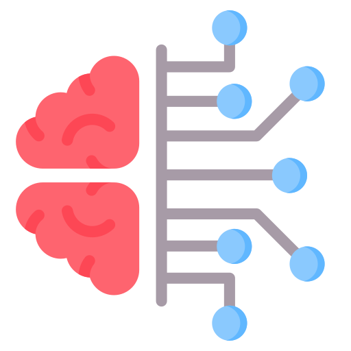

<div align="center">
   

   # NeuraPHP

NeuraPHP brings local AI embeddings to PHP—no APIs, no subscriptions, no external services. Run fast, private, personalized text embeddings directly on your machine, saving money while keeping full control of your data. Simple to install, effortless to use, and built for real‑world PHP apps.

[](https://php.net)
[](LICENSE)
</div>

## Features

- **Local embeddings** — No API calls, no network latency, no data leaving your server
- **PHP FFI** — Direct memory access to a **C library**, no separate process
- **Fluent API** — `Neuraphp::make()->model(ModelReference::fromEnum(Model::AllMiniLML12V2))->embed('text')`
- **Multiple models** — AllMiniLM-L6-v2, AllMiniLM-L12-v2, Paraphrase, BGE, E5, multilingual; or any BERT-compatible HuggingFace model
- **Quantization** — F32, F16, Q4_0, Q4_1 for speed/quality tradeoffs
- **Vector math** — Cosine similarity, dot product, Euclidean distance, L2 normalization
- **CLI tools** — `neuraphp install` for auto-setup, `neuraphp doctor` for diagnostics, `neuraphp info` for configuration
- **Laravel integration** — Optional service provider and facade
- **Framework-agnostic** — Works with any PHP 8.3+ project

**Docs:** [Manual Installation](docs/advanced-guide.md#manual-installation) · [Quick Start](docs/advanced-guide.md#quick-start) · [API Reference](docs/advanced-guide.md#api-reference) · [Supported Models](docs/advanced-guide.md#supported-models) · [Configuration](docs/advanced-guide.md#configuration) · [Laravel Integration](docs/advanced-guide.md#laravel-integration) · [CLI Reference](docs/advanced-guide.md#cli-commands-reference)

### Add to your project:
```bash
composer require b7s/neuraphp
```

## Quick Start

```php
use B7s\Neuraphp\Neuraphp;
use B7s\Neuraphp\ModelReference;
use B7s\Neuraphp\Enums\Model;

// Embed text (uses default model: AllMiniLML6V2)
$result = Neuraphp::make()->embed('Hello world');
echo $result->dimension();  // 384

// Use a specific model
$result = Neuraphp::make()
    ->model(Model::BgeSmallENV15)
    ->embed('Hello world');

// Compare two texts
$similarity = Neuraphp::make()
    ->cosineSimilarity('The cat sat on the mat', 'A feline rested on the rug');
```

> For more examples, custom models, batch embedding, and the full API — see the [Advanced Guide](docs/advanced-guide.md#quick-start)

## ⚠️ Prerequisites: embedding.cpp Library & Model

> **Neuraphp requires `libbert_shared.so` (compiled from embedding.cpp) and a GGUF model file to function.**

**Minimum versions required to compile the library:**

| Tool | Min Version | Install |
|------|-------------|---------|
| Git | 2.0+ | [git-scm.com](https://git-scm.com) |
| CMake | 3.12+ | [cmake.org](https://cmake.org/install/) |
| GNU Make | 3.81+ | `sudo apt install build-essential` / `xcode-select --install` |
| C++ compiler (g++/clang++) | GCC 10+ / Clang 10+ (C++20) | `sudo apt install g++` / `xcode-select --install` |
| Rust (cargo) | 1.79+ | [rustup.rs](https://www.rust-lang.org/tools/install) |
| Git LFS | 2.0+ | `sudo apt install git-lfs` / `brew install git-lfs` |
| Python | 3.8+ | (model conversion only) |

There are two ways to set these up:

---

### Option A: Automatic Installation (Recommended)

Run the installation command - it clones, compiles, and downloads everything for you:

```bash
./vendor/bin/neuraphp install
```

> You need to run this command just once for each model you want to use. If you don't change the model, you don't need to re-run it.

This will:
1. **Check prerequisites** (git, cmake, make, C++ compiler, Rust, git-lfs)
2. **Clone embedding.cpp** into a temp directory and compile `libbert_shared.so`
3. **Download the default model** (all-MiniLM-L6-v2) from HuggingFace
4. **Convert the model** to GGUF format (requires Python 3.8+, torch, transformers)
5. **Copy only final artifacts** to `bin/neuraphp/data/` in your project root
   - **Clean up** temp files and create `bin/neuraphp/data/.gitignore` so artifacts are never committed

**Options:**

```bash
# Install a specific model (short name or full HuggingFace ID)
./vendor/bin/neuraphp install --model=bge-small-en-v1.5 --quantization=f16

# Install a custom BERT-compatible model
./vendor/bin/neuraphp install --model=custom-org/my-bert-model

# Skip library compilation (if already installed)
./vendor/bin/neuraphp install --skip-library

# Skip model download (if already downloaded)
./vendor/bin/neuraphp install --skip-model

# Force re-download/re-compile
./vendor/bin/neuraphp install --force

# Keep model source files after conversion
./vendor/bin/neuraphp install --keep-source

# Use a specific Python for model conversion
./vendor/bin/neuraphp install --python-path=~/myenv/bin/python3

# Check if Neuraphp is properly configured
./vendor/bin/neuraphp doctor

# Show model and configuration info
./vendor/bin/neuraphp info

# With options
./vendor/bin/neuraphp doctor --library-path=/custom/libbert_shared.so
./vendor/bin/neuraphp info --model=all-MiniLM-L6-v2 --quantization=q4_0
```

## Testing

```bash
# Run all tests
composer test

# Run with coverage
composer test:coverage

# Code style
composer pint

# Static analysis
composer stan

# Quality gate
composer catraca

# Run all checks
composer check
```

## License

MIT

---

Logo by: 
<a href="https://www.flaticon.com/free-icons/neuro" title="neuro icons">Neuro icons created by Uniconlabs - Flaticon</a>
